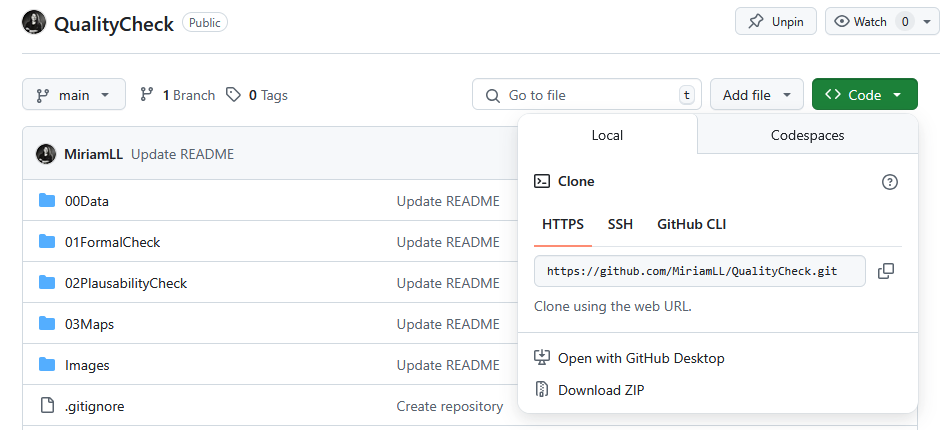
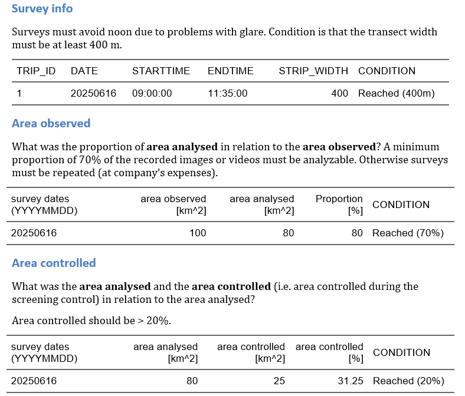
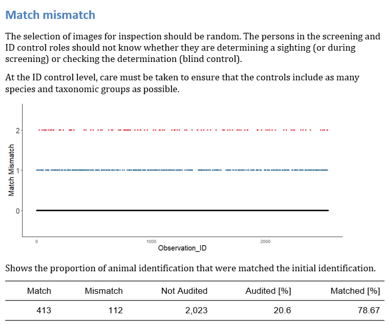
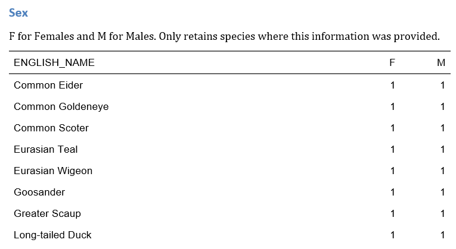

<!-- README.md is generated from README.Rmd. Please edit that file -->

# About

This repository includes the parametrized script to run Quality Checks
in R.

Includes: <br> - **QualityCheck.Rproj** — RStudio project file <br> -
**00QualityCheck.Rmd** — Initial quality check script <br> -
**01FormalCheckandDataValidation.Rmd** — Formal checks and data
validation<br> - **02PlausabilityCheck.Rmd** — Plausibility checks<br> -
**03MapsInteractive.Rmd** — Interactive map visualizations<br>

# Installation

Download or Fork from <https://github.com/MiriamLL/QualityCheck>



# Dependencies

The following packages are required. Install if missing.

``` r
#For reading data
install.packages("here") #for assigning directory in a project
install.packages("readxl") #for reading excelsheet
install.packages("tidyverse") #for data wrangling
install.packages("beepr") #for making a noise when ready

#For report
install.packages("knitr") #for exporting tables in word
install.packages("kableExtra") #for arranging tables in word
install.packages("ggplot2") #for making plots
install.packages("sp") #for reading shapefiles
install.packages("sf") #for plotting shapefiles

install.packages("devtools")
devtools::install_github("MiriamLL/GermanNorthSea") #for loading shapefiles
devtools::install_github("MiriamLL/seamonas") #for accessing Euring information

#For Dinamic maps 
install.packages("tmap") #for creating maps with layers
install.packages("fontawesome") #for adding icons
```

# Start

Open the Project (QualityCheck.Rproj). <br> This is important as it
would more easily localize the folders where the data is and the Rmds.

# Main script

Open the Markdown 00QualityCheck.Rmd


## Conditions

You should have an excel file that have the following sheets, with these
names: <br> - Tripdaten <br> - Basisdaten <br> - Observations <br>
Please provide this order and/or these names for the sheets, or adjust
the script accordingly. <br>

# Formal check

Copy/save the Excel file in the **00Data** directory. <br> Next, paste
the file name into the designated code chunk. <br> To run the chunk,
click the green triangle icon in the top-right corner of the code chunk
(the “Run Current Chunk” button, shown highlighted in a red square).
<br>


## Conditions

The following column names and some relevant fields are checked:

**Trip**:

- `TRIP`: Can be used for descriptions of the columns or left blank.
  <br>
- `TRIP_ID`: This field is mandatory.<br>
- `Dataset_ID`: Leave blank if unknown. <br>
- `CRUISENO`: This field is mandatory. <br>
- `OWPAS`: This field is mandatory. <br>
- `PROJECT`: This field is mandatory.<br>
- `CLUSTER`: This field is mandatory.<br>
- `LAB`: This field is mandatory.<br>
- `SCIENTIST`: This field is mandatory.<br>
- `DATATYPE`: This field is mandatory. <br>
- `TECHNIQUE`: This field is mandatory.<br>
- `OBSERVER`: This field is mandatory.<br>
- `PLANE`: This field is mandatory. <br>
- `NUMBER_OF_PLANES`: This field is mandatory.<br>
- `DOUBLE_PLATFORM`: This field is mandatory.<br>
- `DATE`: This field is mandatory.<br>
- `STARTTIME`: This field is mandatory.<br>
- `STARTTIME`: This field is mandatory.<br>
- `CAMERA_SYSTEM`: This field is mandatory. <br>
- `RESOLUTION`: This field is mandatory.<br>
- `PLANE_FLIGHT_HEIGHT_PLANNED`: This field is mandatory. <br>
- `STRIP_WIDHT`: This field is mandatory. <br>
- `PLANE_SPEED`: This field is mandatory. <br>
- `POSITION_ACCURACY`: This field is mandatory. <br>
- `METHOD_ID`: This field is mandatory.<br>
- `AREA_OBSERVED`: This field is mandatory.<br>
- `AREA_ANALYSED`: This field is mandatory.<br>
- `AREA_CONTROLLED`: This field is mandatory. <br>
- `ID_CONTROLLED`: This field is mandatory.<br>
- `SCREENING_CONTROL_DIFFERENCE`: This field is mandatory.<br>
- `ID_CONTROL_DIFFERENCE`: This field is mandatory. <br>
- `QUALITY_IMPROVEMENT`: This field is mandatory. <br>
- `POSITIONSYSTEM`: This field is mandatory.<br>
- `POSIT_PRECISION_CODE`: This field is mandatory. <br>
- `REFSYSTEM`: This field is mandatory.<br>
- `NOTES`: Can be left blank. <br>

**Basis**:

- `POSITIONS`: Can be used for descriptions of the columns or left
  blank. <br>
- `POSITION_ID`: This field is mandatory. <br>
- `POSITION_ID_CONTROLLED`: Leave blank if not controlled. <br>
- `Dataset_ID`: Leave blank if unknown.<br>
- `TRIP_ID`: This field is mandatory.<br>
- `CRUISENO`: This field is mandatory.<br>
- `CAMERA_NUMBER`: This field is mandatory.<br>
- `TRANSECT_NUMBER`: This field is mandatory.<br>
- `DATE`: This field is mandatory.<br>
- `TIME`: This field is mandatory.<br>
- `LAT_PIC_CENTER`: This field is mandatory.<br>
- `LON_PIC_CENTER`: This field is mandatory.<br>
- `PLANE_FLIGHT_HEIGHT`: This field is mandatory. <br>
- `PIC_AREA_ANALYSED`: This field is mandatory. Some variation is
  expected.<br>
- `GLARE`: This field is mandatory. <br>
- `SEASTATE`: This field is mandatory. <br>
- `TURBIDITY`: This field is mandatory. <br>
- `ICE`: Usually 0 = No Ice. This field is mandatory.<br>
- `CLARITY`: This field is mandatory. <br>
- `PIC_QUALITY`: This field is mandatory. <br>
- `PIC_FILENAME`: Can be left blank. <br>
- `NOTES`: Can be left blank. <br>

**Observations**:

- `OBSERVATIONS`: Can be used for descriptions of the columns or left
  blank.<br>
- `Observation_ID`: This field is mandatory.<br>
- `POSITION_ID`: This field is mandatory.<br>
- `Dataset_ID`: Leave blank if unknown.<br>
- `CRUISENO`: This field is mandatory. <br>
- `ABIOTIC_STRUCTURES`: Can be left blank if no ABIOTIC_STRUCTURES were
  detected.<br>
- `ABIOTIC_OBSERVATIONS`: Can be left blank if no ABIOTIC_OBSERVATIONS
  were detected.<br>
- `OBSERVATION`: Leave blank if the entry corresponds to
  ABIOTIC_STRUCTURES or ABIOTIC_OBSERVATIONS. <br>
- `ENGLISH_NAME_BEFORE_CONTROL`: Leave blank if the entry corresponds to
  ABIOTIC_STRUCTURES or ABIOTIC_OBSERVATIONS.<br>
- `ENGLISH_NAME_CONTROL_ID`: Leave blank if the entry corresponds to
  ABIOTIC_STRUCTURES or ABIOTIC_OBSERVATIONS.<br>
- `ID_MATCH_MISMATCH`: Leave blank if not audited. <br>
- `ENGLISH_NAME`: Leave blank if the entry corresponds to
  ABIOTIC_STRUCTURES or ABIOTIC_OBSERVATIONS.<br>
- `DETECTION_STEP`: Leave blank if the position was not audited.<br>
- `BEHAVIOUR`: Leave blank if no BEHAVIOUR was observed.<br>
- `ACTIVITY`: This field is mandatory. NAs are only allowed for abiotic
  structures. <br>
- `GROUP`: Leave blank if no GROUP was observed.<br>
- `FAMILY_GROUP`: Leave blank if no FAMILY GROUP was observed.<br>
- `ASSOCIATIONS`: Leave blank if no ASSOCIATION was observed.<br>
- `HEADING`: Enter only if calculated; otherwise, leave blank.<br>
- `SUBMERGED`: Leave blank if not observed.<br>
- `AGE_CLASS`: Leave blank if unknown. <br>
- `AGE_YEAR`: Only fill for IMMATURE animals.<br>
- `PLUMAGE`: Leave blank if unknown. <br>
- `SEX`: Leave blank if unknown. <br>
- `LENGTH`: Enter only if calculated; otherwise, leave blank.<br>
- `WING_SPAN`: Enter only if calculated; otherwise, leave blank.<br>
- `FLIGHT_HEIGHT`: Enter only if calculated; otherwise, leave blank.<br>
- `FLIGHT_HEIGHT_CONFIDENCE`: Enter only if calculated; otherwise, leave
  blank.<br>
- `FLIGHT_HEIGHT_METHOD_ID`: Enter only if know; otherwise, leave
  blank.<br>
- `LAT_OBJECT`: This field is mandatory.<br>
- `LON_OBJECT`: This field is mandatory.<br>
- `NOTES`: Can be left blank.<br>

## Output

The process uses the markdown from `01FormalCheckandDataValidation.Rmd`
to generate a report that summarizes the results of column name
verification and field completion checks.


It verifies that all column names are correct and identifies any column
names that do not match the expected ones.


It verifies that required fields are not only filled but also correctly
completed.


If any required columns are missing, the fields cannot be checked, and
the following warning is displayed.

 If
there is any manual correction needed please add on the chunk allocated
for this and re-run this part.<br>

``` r
Corrections<-'No manual corrections were needed'
```

# Plausability check

The process uses the markdown from `02PlausabilityCheck.Rmd` to generate
a report in word that checks if the information reaches the expected
conditions.

## Conditions

**Trip**:<br> - `STRIP_WIDHT`: Must reach a minimum of 400 m. <br> -
`AREA_OBSERVED` and `AREA_ANALYSED`: Percentage of area analysed is
expected to be a minimum of 70%.<br> - `AREA_ANALYSED` and
`AREA_CONTROLLED`: Percentage of area controlled is expected to reach a
minimum of 20%. <br> - `ID_CONTROLLED`: The number of controlled
sightings must at least reach 20% of all sightings.<br>

**Basis**:<br> - `DATE`: Must be presented as YYYYMMDD to automatically
extract the month and classify the season.<br> - `LAT_PIC_CENTER`:
Column name must fit to automatically create the survey effort
maps.<br> - `LON_PIC_CENTER`: Column name must fit to automatically
create the survey effort maps.\<<br> - `GLARE`: Some variation is
expected.<br> - `SEASTATE`: Some variation is expected.<br> -
`TURBIDITY`: Some variation is expected.<br> - `CLARITY`: Some variation
is expected.<br> - `PIC_QUALITY`: Some variation is expected. Percentage
of good quality pictures is expected to be above 80%. <br>

**Observations:**<br> - `ABIOTIC_STRUCTURES`: Can be left blank if no
ABIOTIC_STRUCTURES were detected.<br> - `ABIOTIC_OBSERVATIONS`: Can be
left blank if no ABIOTIC_OBSERVATIONS were detected.<br> -
`ENGLISH_NAME`: It must be written exactly as it appears in EURING,
maintaining the spacing, capitalization, or use of slashes. <br> -
`ID_MATCH_MISMATCH`: The selection of images for inspection should be
random. The persons in the screening and ID control roles should not
know whether they are determining a sighting (or during screening) or
checking the determination (blind control). At the ID control level,
care must be taken to ensure that the controls include as many species
and taxonomic groups as possible. At least 20% of the identifications
are expected to be audited, and that the error is above 70-80%. In
addition, ensure that there is no observer bias, such as when a large
number of individuals from one species are consistently misidentified.
<br> - `DETECTION_STEP`: At least 20% of the screenings should be
reviewed. The initial screener and the auditor are expected to achieve a
minimum of 90% agreement in detection. <br> - `ACTIVITY`: Check that its
filled for all observation. NAs are only allowed for abiotic structures.
In general a balanced proportion between flying and swimming is
expected.<br> - `AGE_CLASS` and `AGE_YEAR`: Check that the information
is plausible.<br> - `LAT_OBJECT` and `LON_OBJECT`: Used to plot the
spatial distribution for each morphological group<br>

## Output

1.  Revision of **control steps**. Including Area observed, Area
    controlled.



2.  Revision of **survey area**. Including the season and a map of the
    surveyed area.


3.  Revision of **environmental conditions**. Visualization of
    environmental conditions during the survey.


4.  Revision of **Observations**. Including species list, check that the
    codes correspond to the species name, check the proportion of birds
    and mammals, check the most common species observed during the
    survey. Check errors in identifications.



5.  Revision of **Plausibility** in the columns Activity, Age class and
    Sex.



6.  **Spatial distribution** per taxonomic/morphological groups.


# Maps

The process uses the markdown from `03MapsInteractive.Rmd` to create a
map showing all survey position and observations. The second map display
sightings per group. Instructions are included.

## Conditions

Check position accuracy and plausibility of observations.
